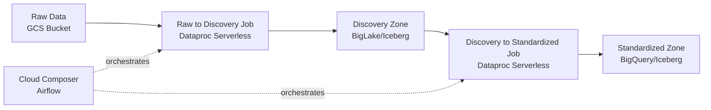

# Data Platform Spark Framework

A PySpark-based ETL pipeline framework for processing environmental data on Google Cloud Platform. This framework provides a standardized approach to ingesting raw data, transforming it through discovery and standardized zones, and orchestrating workflows using Cloud Composer.

## Overview

The Envilink ETL Pipeline Framework is designed to handle multi-stage data processing pipelines that transform raw environmental data into standardized formats suitable for analytics and reporting. The framework supports multiple data sources and provides built-in data quality checks using Great Expectations.

### Key Features

- **Multi-stage ETL**: Supports raw → discovery → standardized data pipeline architecture
- **Multiple Data Sources**: Configurable pipeline configurations for different data sources (air4thai, airbkk, customer_data, etc.)
- **GCP Integration**: Native integration with Google Cloud services (Dataproc Serverless, BigQuery, GCS, Cloud Composer)
- **Data Quality**: Built-in data quality checks using Great Expectations
- **Template-based DDL Generation**: Automatic DDL generation for BigQuery and Iceberg tables
- **Flexible Configuration**: YAML-based configuration for easy pipeline management

### Architecture



### Technology Stack

- **PySpark 3.5.3**: Core data processing engine
- **Apache Sedona 1.8.0**: Geospatial data processing
- **Great Expectations 1.9.0**: Data quality validation
- **Google Cloud Platform**: Dataproc Serverless, BigQuery, GCS, Cloud Composer
- **Python 3.11+**: Runtime environment

## Prerequisites

Before setting up the framework, ensure you have the following:

- **Python 3.11 or higher**: Required Python version
- **[uv](https://docs.astral.sh/uv/) package manager**: Fast Python package installer and resolver
- **Google Cloud SDK (`gcloud`)**: For GCP authentication and deployment
- **GCP Project**: With the following services enabled:
  - Dataproc API
  - BigQuery API
  - Cloud Storage API
  - Cloud Composer API (if using Airflow orchestration)
- **Service Account**: With appropriate permissions for:
  - Dataproc Serverless job execution
  - BigQuery read/write access
  - GCS bucket read/write access
  - Cloud Composer DAG management (if applicable)

## Project Structure

```
data-platform-spark-framework/
├── src/pipeline/          # Core framework code
│   ├── jobs/              # ETL job implementations
│   ├── libs/              # Framework libraries (common, engine)
│   ├── templates/         # DDL templates (BigQuery, Iceberg)
│   └── tools/             # Utility scripts
├── conf/
│   └── <provider>/        # Provider-based organization
│       └── <table>/       # Table-specific configs
├── ddl/                   # Generated DDL files
│   └── <provider>/        # Provider-based organization
│       └── <schema>/      # Schema-based organization (discovery, standardized)
│           └── <table>.sql # Table DDL files
├── dist/                  # Build artifacts
│   ├── pipeline-*.whl     # Main package wheel
│   └── dependences-*.zip  # Dependencies bundle (versioned)
├── main.py                # Entry point for Dataproc jobs
├── Makefile               # Build and deployment automation
└── pyproject.toml         # Project metadata and dependencies
```

## Setup Instructions

### Local Development Setup

1. **Clone the repository**:
   ```bash
   git clone <repo-url>
   cd data-platform-spark-framework
   ```

2. **Install uv** (if not already installed):
   ```bash
   curl -LsSf https://astral.sh/uv/install.sh | sh
   source $HOME/.local/bin/env
   ```

3. **Create virtual environment and install dependencies**:
   ```bash
   make install
   ```
   This will:
   - Create a virtual environment in `.venv/`
   - Install all project dependencies
   - Install the package in editable mode

4. **Configure environment variables**:
   Create a `.env` file in the project root with required GCP credentials:
   ```bash
   GCP_PROJECT_ID=your-project-id
   GCP_REGION=us-central1
   GCP_ZONE=us-central1-a
   RAW_BUCKET=your-raw-bucket
   STAGING_BUCKET=your-staging-bucket
   CONFIG_BUCKET=your-config-bucket
   BIGLAKE_CATALOG=your-biglake-catalog
   ```
   
   **Note**: All bucket variables should be provided without the `gs://` prefix. The prefix is automatically added when needed.

### Environment Configuration

The framework uses environment variables to configure system-wide settings with placeholders (e.g., `${env.gcp.project_id}`). These values are provided via `src/pipeline/env_config.yaml`, which is generated from environment variables.

To generate `env_config.yaml`:

```bash
# From environment variables
make render-env

# From a .env file
make render-env ENV_FILE=.env
```

**Required Environment Variables**:
- `GCP_PROJECT_ID`: Your GCP project ID
- `GCP_REGION`: GCP region (e.g., `us-central1`)
- `RAW_BUCKET`: GCS bucket name for raw data (without `gs://` prefix - automatically added)
- `BIGLAKE_CATALOG`: BigLake catalog name

**Optional Environment Variables**:
- `GCP_ZONE`: GCP zone
- `STAGING_BUCKET`: GCS bucket name for staging data (without `gs://` prefix - automatically added)
- `CONFIG_BUCKET`: GCS bucket name for configuration files (without `gs://` prefix - automatically added)
- `DISCOVERY_BUCKET`: GCS bucket name for discovery zone (without `gs://` prefix - automatically added, defaults to `RAW_BUCKET`)
- `STANDARDIZED_BUCKET`: GCS bucket name for standardized zone (without `gs://` prefix - automatically added, defaults to `STAGING_BUCKET`)

## Build Process

The framework uses a Makefile-based build system to create deployment artifacts.

### Building the Package

```bash
# Build wheel and dependencies
make build
```

This command will:
1. Create the `dist/` directory
2. Install dependencies to `dist/libs/`
3. Create `dependences-<version>.zip` from the dependencies (version extracted from `pyproject.toml`)
4. Build the wheel file (`pipeline-1.0.0-py3-none-any.whl`)

**Build Artifacts**:
- `dist/pipeline-1.0.0-py3-none-any.whl`: Main package wheel file
- `dist/dependences-1.0.0.zip`: Dependencies bundle (Great Expectations, marshmallow, tzlocal, altair)

### Generating DDL Files

```bash
# Generate DDL files for all pipelines
make render-ddl
```

This generates DDL files for both discovery and standardized zones based on pipeline configurations in `conf/`. Output files are organized by provider and schema: `ddl/<provider>/<schema>/<table>.sql`.

### Generating Environment Config

```bash
# Generate env_config.yaml from environment variables
make render-env

# Or from a .env file
make render-env ENV_FILE=.env
```

## Deployment

### Manual Deployment

Deploy the built artifacts to Google Cloud Storage:

```bash
# Deploy to GCS bucket (CONFIG_BUCKET is required)
CONFIG_BUCKET=my-bucket make deploy
```

**Note**: `CONFIG_BUCKET` should be provided without the `gs://` prefix. The `gs://` prefix is automatically added by the Makefile.

**What Gets Deployed**:
- Wheel file → `gs://<bucket>/whl/pipeline-*.whl`
- Dependencies → `gs://<bucket>/zip/dependences-<version>.zip` (versioned based on `pyproject.toml`)

### Upload Pipeline Configurations

Upload pipeline YAML configurations to GCS:

```bash
# Upload pipeline configurations (CONFIG_BUCKET is required)
CONFIG_BUCKET=my-bucket make upload-config
```

**Note**: `CONFIG_BUCKET` should be provided without the `gs://` prefix. The `gs://` prefix is automatically added by the Makefile.

Pipeline configurations are uploaded to `gs://<bucket>/pipelines/refine/<provider>/<table>/`.

### Sync Pipeline Configurations

Sync pipeline YAML configurations from the GCS config bucket to your local `conf/` directory (inverse of upload-config):

```bash
# Sync from GCS to local (CONFIG_BUCKET is required)
CONFIG_BUCKET=my-bucket make config-sync
```

**Note**: `CONFIG_BUCKET` should be provided without the `gs://` prefix. The `gs://` prefix is automatically added by the Makefile.

Contents of `gs://<bucket>/pipelines/refine/` are synced into `conf/` (or `PIPELINES_DIR` if overridden).

### Deployment Prerequisites

Before deploying, ensure:
1. You are authenticated with GCP:
   ```bash
   gcloud auth login
   gcloud config set project YOUR_PROJECT_ID
   ```
2. You have write access to the target GCS bucket
3. The build artifacts exist in `dist/` (run `make build` first)

## Available Make Commands

| Command | Description |
|---------|-------------|
| `make build` | Builds the wheel file and dependencies zip |
| `make deploy` | Uploads wheel and dependencies to GCS |
| `make clean` | Removes build directory and virtual environment |
| `make install` | Installs package in virtual environment |
| `make render-env` | Generate env_config.yaml from environment variables |
| `make render-ddl` | Generate all DDL files (discovery and standardized zones) |
| `make upload-config` | Upload pipeline configurations to GCS |
| `make config-sync` | Sync pipeline configs from GCS config bucket to local `conf` |
| `make help` | Display available targets and their descriptions |

**Configuration Variables** (can be overridden via environment variables):
- `CONFIG_BUCKET`: GCS bucket name for deployment (required, without `gs://` prefix - automatically added)
- `PIPELINES_DIR`: Directory containing pipeline configs (default: `conf`)

## Quick Start Example

Here's a complete example to get started:

1. **Prerequisites Check**:
   ```bash
   python --version  # Should be 3.11+
   uv --version      # Should be installed
   gcloud --version  # Should be installed
   ```

2. **Clone and Setup**:
   ```bash
   git clone <repo-url>
   cd data-platform-spark-framework
   make install
   ```

3. **Configure GCP Credentials**:
   ```bash
   # Create .env file
   cat > .env << EOF
   GCP_PROJECT_ID=your-project-id
   GCP_REGION=us-central1
   RAW_BUCKET=your-raw-bucket
   BIGLAKE_CATALOG=your-catalog
   EOF
   
   # Generate env_config.yaml
   make render-env ENV_FILE=.env
   ```

4. **Build the Project**:
   ```bash
   make build
   ```

5. **Deploy to GCS**:
   ```bash
   # Authenticate with GCP
   gcloud auth login
   gcloud config set project your-project-id
   
   # Deploy (CONFIG_BUCKET without gs:// prefix)
   CONFIG_BUCKET=your-config-bucket make deploy
   CONFIG_BUCKET=your-config-bucket make upload-config
   ```

6. **Verify Deployment**:
   ```bash
   gcloud storage ls gs://your-config-bucket/whl/
   gcloud storage ls gs://your-config-bucket/zip/
   gcloud storage ls gs://your-config-bucket/pipelines/
   ```

## Pipeline Configuration

Pipeline configurations are defined in YAML files under `conf/<provider>/<table>/`. Each pipeline has three configuration files:

- `dag_config.yaml`: DAG-level configuration (retries, Dataproc settings)
- `raw_to_discovery.yaml`: Configuration for raw → discovery stage (must include `provider` and `pipeline_name` using the `raw_to_disc_*` convention, e.g. `raw_to_disc_air4thai`)
- `discovery_to_standardized.yaml`: Configuration for discovery → standardized stage (must include `provider` and `pipeline_name` using the `disc_to_std_*` convention, e.g. `disc_to_std_air4thai`)

For full field reference, naming rules, and examples, see the [Pipeline Configuration Guide](doc/pipeline_configuration_guide.md).

### Example Pipeline Configuration

See [`conf/pcd/air4thai/dag_config.yaml`](conf/pcd/air4thai/dag_config.yaml) for a complete example. Key sections include:

- **Pipeline Metadata**: Name, description, owner, tags
- **Stage Definitions**: Configuration for each ETL stage
  - `raw_to_discovery`: Raw data ingestion
  - `discovery_to_standardized`: Data standardization
- **Dataproc Serverless Settings**: Spark executor/driver configuration

### Running Jobs Locally

To test jobs locally (requires Spark installation):

```bash
# Activate virtual environment
source .venv/bin/activate

# Run a job
python main.py \
  --job-name raw_to_discovery \
  --provider pcd \
  --table air4thai \
  --data-date 2024-01-01
```

## Troubleshooting

### Build Failures

**Issue**: `uv: command not found`
- **Solution**: Install uv using the curl command in the Setup section

**Issue**: Dependencies fail to install
- **Solution**: Ensure Python 3.11+ is installed and check network connectivity

**Issue**: Wheel build fails
- **Solution**: Ensure all dependencies in `pyproject.toml` are valid and accessible

### Deployment Issues

**Issue**: `Permission denied` when deploying to GCS
- **Solution**: 
  - Verify GCP authentication: `gcloud auth list`
  - Check bucket permissions: `gsutil iam get gs://your-bucket`
  - Ensure service account has `storage.objects.create` permission

**Issue**: `Bucket not found`
- **Solution**: Create the bucket first: `gsutil mb gs://your-bucket`

### GCP Authentication Problems

**Issue**: `gcloud` commands fail with authentication errors
- **Solution**:
  ```bash
  gcloud auth login
  gcloud auth application-default login
  ```

**Issue**: Service account authentication fails
- **Solution**: Ensure service account key is properly configured and has necessary permissions

### Missing Dependencies

**Issue**: Import errors when running jobs
- **Solution**: 
  - Verify `dependences-<version>.zip` includes all required packages
  - Check that `requirements.txt` dependencies are included in the build
  - Rebuild: `make clean && make build`

### Environment Configuration Issues

**Issue**: `env_config.yaml` not generated or missing values
- **Solution**:
  - Verify all required environment variables are set
  - Check `.env` file format (no spaces around `=`)
  - Run `make render-env ENV_FILE=.env` with verbose output

## Additional Resources

- [Pipeline Configuration Guide](doc/pipeline_configuration_guide.md) – YAML field reference, naming conventions (`raw_to_disc_*`, `disc_to_std_*`), and examples
- [Google Cloud Dataproc Serverless Documentation](https://cloud.google.com/dataproc-serverless/docs)
- [Cloud Composer Documentation](https://cloud.google.com/composer/docs)
- [PySpark Documentation](https://spark.apache.org/docs/latest/api/python/)
- [Great Expectations Documentation](https://docs.greatexpectations.io/)
- [uv Documentation](https://docs.astral.sh/uv/)


