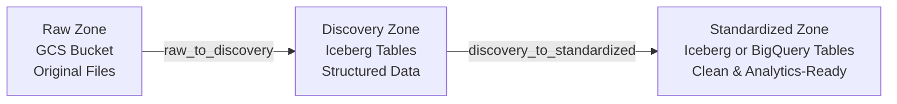

# Pipeline Configuration Guide

This guide provides comprehensive instructions and reference material for creating new YAML pipeline configurations in the Envilink Pipeline Framework.

---

## Objective

This document is designed for users who want to create pipeline configurations for data ingestion and transformation. Specifically, this guide covers:

- **`raw_to_discovery.yaml`**: Configuration for ingesting raw data from GCS into the discovery zone (Iceberg tables)
- **`discovery_to_standardized.yaml`**: Configuration for transforming and standardizing data from discovery to standardized zone (BigQuery or Iceberg)

This guide focuses exclusively on writing and validating YAML configuration files. It includes:

- Step-by-step instructions for creating pipeline configurations
- Complete field reference for both configuration types
- Transformation and data quality check options
- Common patterns and examples
- Troubleshooting configuration issues

**What this guide does NOT cover**: Operational tasks such as running jobs, deploying pipelines, or framework internals.

---

## Table of Contents

1. [Quick Start Guide](#quick-start-guide)
2. [Prerequisites](#prerequisites)
3. [Architecture Overview](#architecture-overview)
4. [Configuration Reference](#configuration-reference)
5. [Transformation Reference](#transformation-reference)
6. [Technical Columns with Transformations](#technical-columns-with-transformations)
7. [Data Quality Checks](#data-quality-checks)
8. [Load Types](#load-types)
9. [Common Patterns & Recipes](#common-patterns--recipes)
10. [Validation Checklist](#validation-checklist)
11. [Troubleshooting](#troubleshooting)
12. [Complete Examples](#complete-examples)

---

## Quick Start Guide

This section provides a step-by-step guide to create a new pipeline from scratch.

### Step 1: Understand Your Data Source and Structure

Before creating your pipeline configuration:

1. **Examine your raw data**:
   - For JSON: Check nesting levels and array structures
   - For CSV: Verify headers and data types
   - For GeoJSON: Identify geometry column and properties
   - For Shapefile: Ensure all required files (.shp, .shx, .dbf, .prj) are available
   - For GeoPackage: Identify layer names and geometry columns

2. **Identify key information**:
   - Data format (CSV, JSON, GeoJSON, Parquet, Shapefile, GeoPackage)
   - Source location in GCS (bucket and path pattern)
   - Date partitioning strategy (usually by `data_date`)
   - Required columns and their data types
   - Business rules for transformations

### Step 2: Create Pipeline Directory Structure

Create a new directory for your pipeline using the provider and table name:

```bash
mkdir -p conf/pipelines/refine/<provider>/<table>
```

**Directory Structure**: 
- `refine`: Pipeline category (fixed layer for refined/processed pipelines)
- `<provider>`: Data provider or source system identifier (e.g., `pcd`, `nasa`, `crm_system`)
- `<table>`: Target table name (e.g., `air4thai`, `viirs`, `customers`)
- Use lowercase with underscores for both provider and table names

**Examples**:
- `conf/pipelines/refine/pcd/air4thai/`
- `conf/pipelines/refine/nasa/viirs/`
- `conf/pipelines/refine/crm_system/customers/`

### Step 3: Create `raw_to_discovery.yaml`

Create the first configuration file that defines how raw data is ingested into the discovery zone:

1. **Define source configuration**:
   - Set `type: gcs` for Google Cloud Storage
   - Specify `format` (csv, json, geojson, parquet, shapefile, geopackage)
   - Set `path` with date placeholders (`{{ ds_nodash }}` for YYYYMMDD format)
   - Add format-specific `options` if needed (e.g., `multiLine: true` for JSON)

2. **Define target configuration**:
   - Set `catalog` to `${env.biglake.catalog}`
   - Set `schema` to `discovery`
   - Set `table` name
   - Set `location` to GCS path for Iceberg storage
   - Set `table_type: iceberg`
   - Set `load_type: partition_overwrite` (most common)
   - Define `partition_columns` (usually `['data_date']`)
   - Add `technical_columns` (data_date, load_timestamp)
   - Map all `columns` from source with `type: string` (discovery zone casts everything to string)

3. **Add data quality checks** (optional):
   - Add `not_null` checks for required fields
   - Set `on_fail: FAIL` for critical checks

**Example**:
```yaml
pipeline_name: raw_to_disc_my_pipeline
description: Ingest raw data into discovery zone
provider: data_source
source:
  type: gcs
  format: csv
  path: gs://${env.storage.raw_bucket}/raw_to_disc_my_pipeline/{{ ds_nodash }}
  options:
    header: true
    inferSchema: false
target:
  catalog: ${env.biglake.catalog}
  schema: discovery
  table: my_pipeline
  location: gs://${env.storage.discovery_bucket}/raw_to_disc_my_pipeline
  table_type: iceberg
  load_type: partition_overwrite
  partition_columns:
  - data_date
  technical_columns:
  - name: data_date
  - name: load_timestamp
  columns:
  - name: id
    type: string
  - name: name
    type: string
  quality_checks:
  - type: not_null
    column: id
    on_fail: FAIL
```

### Step 4: Create `discovery_to_standardized.yaml`

Create the second configuration file that transforms data from discovery to standardized zone:

1. **Define source configuration**:
   - Set `type` to `iceberg`
   - Set `catalog` to `${env.biglake.catalog}`
   - Set `schema` to `discovery`
   - Set `table` to match the discovery table name

2. **Define target configuration**:
   - Set `catalog` to `${env.gcp.project_id}` for BigQuery
   - Set `schema` to `standardized`
   - Set `table` name
   - Set `table_type` (bigquery or iceberg)
   - Set `load_type` (merge or partition_overwrite)
   - Define `merge_keys` if using `load_type: merge`
   - Define `partition_columns`
   - Add `technical_columns` with `bigquery_type` for BigQuery
   - Map `columns` with transformations and proper types

3. **Add transformations**:
   - Apply `trim`, `lower`, `upper` for string cleaning
   - Use `to_date` or `to_timestamp` for date/time conversions
   - Use `coalesce` for handling missing values
   - Apply type conversions (string → integer, double, etc.)

4. **Add data quality checks**:
   - Validate transformed data
   - Use `FAIL` for critical checks, `WARN` for observations

**Example**:
```yaml
pipeline_name: disc_to_std_my_pipeline
description: Cleanse and standardize data from discovery to standardized zone
provider: data_source
source:
  type: iceberg
  catalog: ${env.biglake.catalog}
  schema: discovery
  table: my_pipeline
target:
  catalog: ${env.gcp.project_id}
  schema: standardized
  table: my_pipeline
  table_type: bigquery
  load_type: merge
  merge_keys:
  - id
  partition_columns:
  - data_date
  technical_columns:
  - name: data_date
    bigquery_type: DATE
  - name: load_timestamp
    bigquery_type: TIMESTAMP
  columns:
  - name: id
    source_column: id
    type: integer
    bigquery_type: INT64
  - name: name
    source_column: name
    type: string
    bigquery_type: STRING
    transformations:
    - type: trim
  quality_checks:
  - type: not_null
    column: id
    on_fail: FAIL
```

---


## Prerequisites

Before creating your pipeline configuration, ensure you have:

- [ ] **Raw data file** uploaded to GCS raw bucket
- [ ] **Sample of the data** to understand its structure
- [ ] **Business requirements** for column naming and transformations
- [ ] **Data quality rules** identified (required fields, value ranges, etc.)
- [ ] **Access to environment variables** in `.env`
- [ ] **Partition strategy** determined (usually by `data_date`)

### Understanding Your Data

> [!TIP]
> Before writing configuration, examine your raw data structure:
> - For JSON: Check nesting levels and array structures
> - For CSV: Verify headers and data types
> - For GeoJSON: Identify geometry column and properties
> - For Shapefile: Ensure all required files (.shp, .shx, .dbf, .prj) are available
> - For GeoPackage: Identify layer names and geometry columns

---

## Architecture Overview

The Envilink Pipeline Framework uses a **three-zone architecture**:



### Zone Details

| Zone | Storage | Format | Purpose |
|------|---------|--------|---------|
| **Raw** | GCS | CSV, JSON, GeoJSON, Shapefile, GeoPackage | Original data preservation |
| **Discovery** | GCS (Iceberg) | Iceberg Tables | Schema validation, exploration |
| **Standardized** | GCS (Iceberg) or BigQuery | Iceberg or BigQuery Tables | Analytics, reporting, ML |

---

## Configuration Reference

## File Structure

All pipeline configurations are stored in `conf/pipelines/refine/<provider>/<table>/` directory. Each pipeline directory must contain both required YAML files:

```
conf/pipelines/
└── refine/
    ├── <provider>/
    │   └── <table>/
    │       ├── raw_to_discovery.yaml
    │       └── discovery_to_standardized.yaml
    │
    └── <another_provider>/
        └── <another_table>/
            ├── raw_to_discovery.yaml
            └── discovery_to_standardized.yaml
```

**Directory Structure**:
- `refine`: Pipeline category (fixed layer for refined/processed pipelines)
- `<provider>`: Data provider or source system identifier
- `<table>`: Target table name
- Use lowercase with underscores for both provider and table names

**Examples**:
```
conf/pipelines/
└── refine/
    ├── pcd/
    │   └── air4thai/
    │       ├── raw_to_discovery.yaml
    │       └── discovery_to_standardized.yaml
    ├── nasa/
    │   └── viirs/
    │       ├── raw_to_discovery.yaml
    │       └── discovery_to_standardized.yaml
    └── crm_system/
        └── customers/
            ├── raw_to_discovery.yaml
            └── discovery_to_standardized.yaml
```

## Environment Variables Reference

You can reference environment variables in your configuration files using the `${env.key.path}` pattern.

### Using Environment Variables

Reference environment variables in your YAML configuration files:

```yaml
source:
  path: gs://${env.storage.raw_bucket}/my_pipeline/{{ ds_nodash }}

target:
  catalog: ${env.biglake.catalog}
  location: gs://${env.storage.discovery_bucket}/my_pipeline
  schema: discovery
```

### Common Variables

Commonly used environment variables:

- **`${env.gcp.project_id}`**: GCP project ID
- **`${env.storage.raw_bucket}`**: GCS bucket name for raw data
- **`${env.storage.discovery_bucket}`**: GCS bucket name for discovery zone
- **`${env.biglake.catalog}`**: BigLake catalog name

## Raw to Discovery Configuration

The `raw_to_discovery.yaml` file defines how raw data files are loaded into Iceberg tables in the discovery zone.

> [!NOTE]
> **Discovery Zone Data Types**: All columns in the discovery zone are automatically cast to `string` type, regardless of their original data type. This preserves raw data integrity and allows for flexible data exploration before applying type conversions in the standardized zone.
> 
> **Why String Type?**: Using string type in the discovery zone allows:
> - Preservation of original data values without type conversion errors
> - Flexible exploration of data structure and content
> - Deferred type decisions until the standardized zone where business rules apply
> - Handling of inconsistent or malformed data that might fail type conversion

### Schema Structure

```yaml
pipeline_name: <pipeline_name>
description: <description>
provider: <provider>
source:
  type: <source_type>
  format: <format>
  path: <path>
  options: <options>
  transformations: <transformations>  # Optional
target:
  catalog: <catalog>
  schema: <schema>
  table: <table>
  location: <gcs_path>
  table_type: <table_type>
  load_type: <load_type>
  partition_columns: <list>
  technical_columns: <list>
  columns: <list>
  quality_checks: <list>  # Optional
```

### Field Descriptions

#### Top-Level Fields

- **pipeline_name** (required): Unique identifier for the pipeline (string). Use the `raw_to_disc_*` naming convention (e.g., `raw_to_disc_air4thai`, `raw_to_disc_customer_data`).
- **description** (optional): Human-readable description of the pipeline (string)
- **provider** (required): Data provider or source system identifier (string)

#### Source Configuration

The `source` section defines where to read data from:

- **type** (required): Source type. Currently supported:
  - `gcs`: Google Cloud Storage
  
- **format** (required): File format. Supported formats:
  - `json`: JSON files
  - `csv`: CSV files
  - `parquet`: Parquet files
  - `geojson`: GeoJSON files
  - `shapefile`: ESRI Shapefiles
  - `geopackage`: OGC GeoPackage files

- **path** (required): Path to source data. Can use environment variables and date partitioning:
  - **Folder path** (recommended): `gs://${env.storage.raw_bucket}/pipeline_name/{{ ds_nodash }}`
    - All files in the folder will be read
    - Best for production pipelines with multiple files per day
  - **Single file path** (supported): `gs://${env.storage.raw_bucket}/pipeline_name/{{ ds_nodash }}/data.json`
    - Specific file will be read
    - Useful for testing or single-file scenarios
  - **Date in filename** (supported): `gs://${env.storage.raw_bucket}/pipeline_name/data_{{ ds_nodash }}.csv`
    - Useful when files are dumped into a single directory with date-stamped filenames
  - **Placeholders**:
    - `{{ ds_nodash }}`: Replaced with execution date in `YYYYMMDD` format
    - `{{ ds }}`: Replaced with execution date in `YYYY-MM-DD` format
  
  **Data Date Filtering**: The framework uses a dual mechanism to ensure only data for the specified date is processed:
  
  1. **Path-based filtering**: The `data_date` parameter is incorporated into the source path by replacing `{{ ds }}` or `{{ ds_nodash }}` placeholders. This ensures only data for the specified date is read from partitioned storage (e.g., `gs://bucket/data/2024-01-01/` or `gs://bucket/data/20240101/`).
  
  2. **Column-based filtering**: After reading the data, if a `data_date` column exists in the DataFrame, an additional filter is automatically applied to ensure only rows matching the job's `data_date` parameter are included. This provides an extra layer of data integrity for sources that may contain multiple dates.
  
  **Why Both Mechanisms?**: The dual filtering approach ensures data integrity even if:
  - Path-based filtering is not sufficient (e.g., files contain multiple dates)
  - Data is incorrectly partitioned in source storage
  - Source files are manually moved or reorganized

- **options** (optional): Format-specific options (dictionary):
  - For JSON: `multiLine: true` (for multi-line JSON files)
  - For CSV: `header: true`, `inferSchema: false`
  - For Parquet: `mergeSchema: true` (to merge schemas from multiple files)

- **transformations** (optional): DataFrame-level transformations applied before column mapping (list):
  - See [DataFrame-Level Transformations](#dataframe-level-transformations) section

#### Target Configuration

The `target` section defines where to write the data:

- **catalog** (required): Catalog name for BigLake. Use `${env.biglake.catalog}`

- **schema** (required): Schema/database name. Use `discovery` for discovery zone

- **table** (required): Target table name (string)

- **description** (optional): Table description (string). Added as comment/description in DDL.

- **location** (required): GCS path for Iceberg table storage:
  - `gs://${env.storage.discovery_bucket}/<table_name>`

- **table_type** (required): Must be `iceberg` for discovery zone

- **load_type** (required): Loading strategy. Options:
  - `partition_overwrite`: Overwrites data in specified partitions
  - See [Load Types](#load-types) section for details

- **description** (optional): Table description (string)

- **partition_columns** (required): List of column names used for partitioning:
  - Common: `['data_date']`
  - Multiple partitions: `['data_date', 'region']`

- **technical_columns** (required): System-managed columns (list):
  - `name`: Column name
  - `description`: Column description (optional)
  - Common technical columns:
    - `data_date`: Date partition (DATE) - Automatically populated from job's data_date parameter
    - `utc_data_date`: UTC date partition (DATE) - Automatically populated from job's data_date parameter
    - `load_timestamp`: Load timestamp (TIMESTAMP) - Automatically populated with current timestamp
    - `effective_start_date`: Effective start date (DATE) - Automatically populated from data_date
    - `effective_end_date`: Effective end date (DATE) - Automatically set to '9999-12-31' for current records
    - `is_current`: Current record flag (BOOLEAN) - Automatically set to `true`
  
  **Automatic Population**: Technical columns are automatically populated by the framework based on their names. The framework infers values from the column name:
  - `data_date`: Uses the job's `data_date` parameter (YYYY-MM-DD format)
  - `utc_data_date`: Uses the job's `data_date` parameter (YYYY-MM-DD format) - same as data_date
  - `load_timestamp`: Uses Spark's `current_timestamp()` function
  - `effective_start_date`: Uses the job's `data_date` parameter
  - `effective_end_date`: Set to '9999-12-31' (used for slowly changing dimensions)
  - `is_current`: Set to `true` (used for slowly changing dimensions)
  - Other date columns: Default to `data_date` if name ends with `_date`
  - Other timestamp columns: Default to `current_timestamp()` if name ends with `_timestamp` or `_ts`

- **columns** (required): List of column definitions:
  - `name`: Target column name (required)
  - `source_column`: Source column path (optional, defaults to `name`)
  - `type`: Spark data type (required, e.g., `string`, `integer`, `double`, `date`, `timestamp`)
  - `description`: Column description (optional, added as comment in DDL)
  
  **Note**: For nested JSON, use dot notation for `source_column`:
  - `station.stationID`
  - `measurement.PM25`

- **quality_checks** (optional): Data quality validations. See [Data Quality Checks](#data-quality-checks) section

### Example: Raw to Discovery

```yaml
pipeline_name: raw_to_disc_air4thai
description: Ingest raw Air4Thai data into the discovery zone.
provider: pcd
source:
  type: gcs
  format: json
  path: gs://${env.storage.raw_bucket}/air4thai_v3/{{ ds_nodash }}
  options:
    multiLine: true
  transformations:
  - type: explode
    column: stations
    alias: station
  - type: explode
    column: station.data
    alias: measurement
target:
  catalog: ${env.biglake.catalog}
  schema: discovery
  table: air4thai
  description: Ingest raw Air4Thai data into the discovery zone.
  location: gs://${env.storage.discovery_bucket}/air4thai
  table_type: iceberg
  load_type: partition_overwrite
  partition_columns:
  - data_date
  technical_columns:
  - name: data_date
    description: Partition date
  - name: load_timestamp
    description: Load timestamp
  columns:
  - name: stationID
    source_column: station.stationID
    type: string
    description: Station Identifier
  - name: DATETIMEDATA
    source_column: measurement.DATETIMEDATA
    type: string
    description: Measurement timestamp
  - name: PM25
    source_column: measurement.PM25
    type: string
    description: PM2.5 value
  quality_checks:
  - type: not_null
    column: DATETIMEDATA
    on_fail: FAIL
```

## Discovery to Standardized Configuration

The `discovery_to_standardized.yaml` file defines how data is transformed and loaded into BigQuery tables in the standardized zone.

### Schema Structure

```yaml
pipeline_name: <pipeline_name>
description: <description>
provider: <provider>
source:
  type: <source_type>
  catalog: <catalog>
  schema: <schema>
  table: <table>
target:
  catalog: <catalog>
  schema: <schema>
  table: <table>
  table_type: <table_type>
  load_type: <load_type>
  merge_keys: <list>  # Required for merge
  partition_columns: <list>
  technical_columns: <list>
  columns: <list>
  quality_checks: <list>  # Optional
```

### Field Descriptions

#### Top-Level Fields

- **pipeline_name** (required): Unique identifier for the pipeline (string). Use the `disc_to_std_*` naming convention (e.g., `disc_to_std_air4thai`, `disc_to_std_customer_data`). Should correspond to the same pipeline as the paired `raw_to_discovery.yaml` (e.g., `raw_to_disc_air4thai` pairs with `disc_to_std_air4thai`).
- **description** (optional): Human-readable description

#### Source Configuration

- **type** (required): Source type. Use `iceberg` for discovery tables.
- **catalog** (required): Catalog name. Use `${env.biglake.catalog}` to reference discovery zone
- **schema** (required): Schema name. Use `discovery`
- **table** (required): Source table name (from discovery zone)

**Data Date Filtering**: The framework automatically filters data by `data_date` when reading from discovery tables. Discovery tables are partitioned by `data_date` (as the first partition), and this filtering ensures data integrity by processing only the correct partition even if the table contains multiple date partitions. The framework filters on the `data_date` column after reading from the table, ensuring only rows matching the job's `data_date` parameter are included.

#### Target Configuration

- **catalog** (required): BigQuery project ID. Use `${env.gcp.project_id}`
- **region** (optional): GCP region for the BigQuery dataset (e.g., `asia-southeast1`). Used in `CREATE SCHEMA` DDL.
- **schema** (required): BigQuery dataset name. Use `standardized`
- **table** (required): Target table name
- **table_type** (required): Table storage type:
  - `bigquery`: BigQuery native tables (recommended for analytics)
  - `iceberg`: Iceberg tables (for advanced use cases)
- **load_type** (required): Loading strategy:
  - `merge`: Upsert operation using merge keys
  - `partition_overwrite`: Overwrites data in specified partitions
- **merge_keys** (required if `load_type: merge`): List of columns used for matching records
- **partition_columns** (required): List of partition columns (e.g., `['data_date']`)
- **technical_columns** (required): System-managed columns with BigQuery types:
  - `name`: Column name
  - `bigquery_type`: BigQuery data type (e.g., `DATE`, `TIMESTAMP`, `STRING`, `INT64`, `FLOAT64`)
  - `description`: Column description (optional)
  
  **Automatic Population**: Technical columns are automatically populated by the framework based on their names, same as in raw_to_discovery. The framework infers values from the column name:
  - `data_date`: Uses the job's `data_date` parameter (YYYY-MM-DD format)
  - `utc_data_date`: Uses the job's `data_date` parameter (YYYY-MM-DD format) - same as data_date
  - `load_timestamp`: Uses Spark's `current_timestamp()` function
  - `effective_start_date`: Uses the job's `data_date` parameter
  - `effective_end_date`: Set to '9999-12-31' (used for slowly changing dimensions)
  - `is_current`: Set to `true` (used for slowly changing dimensions)
  
  **Type Requirements**: For BigQuery tables, you must specify `bigquery_type` for all technical columns. The framework will validate that `bigquery_type` is provided for each column.
- **columns** (required): List of column definitions with transformations:
  - `name`: Target column name (required)
  - `source_column`: Source column name (optional, defaults to `name`)
  - `type`: Spark data type (required)
  - `bigquery_type`: BigQuery data type (required for BigQuery tables)
  - `description`: Column description (optional)
  - `transformations`: List of transformations to apply (optional)

### Example: Discovery to Standardized

```yaml
pipeline_name: 'disc_to_std_air4thai'
description: 'Cleanse and standardize Air4Thai data from discovery to standardized zone.'
provider: 'pcd'

source:
  type: 'iceberg'
  catalog: '${env.biglake.catalog}'
  schema: 'discovery'
  table: 'air4thai'

target:
  catalog: '${env.gcp.project_id}'
  schema: 'standardized'
  table: 'air4thai'
  description: 'Standardized Air4Thai air quality data'
  table_type: 'bigquery'
  load_type: 'merge'
  merge_keys:
    - 'station_id'
    - 'datetime_data'
  partition_columns:
    - 'data_date'
  technical_columns:
    - name: 'data_date'
      bigquery_type: 'DATE'
      description: 'Partition date'
    - name: 'load_timestamp'
      bigquery_type: 'TIMESTAMP'
      description: 'Load timestamp'
  columns:
    - name: 'station_id'
      source_column: 'stationID'
      type: 'string'
      bigquery_type: 'STRING'
      description: 'Station Identifier'
      transformations:
        - type: 'trim'
    - name: 'datetime_data'
      source_column: 'DATETIMEDATA'
      type: 'timestamp'
      bigquery_type: 'TIMESTAMP'
      description: 'Measurement timestamp'
      transformations:
        - type: 'to_timestamp'
          format: 'yyyy-MM-dd HH:mm:ss'
    - name: 'pm25'
      source_column: 'PM25'
      type: 'double'
      bigquery_type: 'FLOAT64'
      description: 'PM2.5 value'
  quality_checks:
    - type: 'not_null'
      column: 'station_id'
      on_fail: 'FAIL'
    - type: 'value_in_range'
      column: 'pm25'
      min_value: 0
      max_value: 1000
      on_fail: 'WARN'
```

## Transformation Reference

Transformations are applied to columns in the order they are specified in the `transformations` list.

### Column-Level Transformations

Column-level transformations are applied to individual columns during the discovery-to-standardized phase. Available types include: `trim`, `lower`, `upper`, `substring`, `regexp_replace`, `to_date`, `to_timestamp`, `to_time`, `combine_date_time`, `date_format`, `binning`, `coalesce`, `static_value`, `to_wkb`, and `point_in_polygon`.

#### trim

Removes leading and trailing whitespace from string values.

**Example**:
| Before (customer_name) | After (customer_name) |
|-----------------------|------------------------|
| "  John Doe  "      | "John Doe"             |
| "Alice   "          | "Alice"                |

```yaml
transformations:
  - type: 'trim'
```

**Example**:
```yaml
columns:
  - name: 'customer_name'
    source_column: 'customer_name'
    type: 'string'
    bigquery_type: 'STRING'
    transformations:
      - type: 'trim'
```

#### lower

Converts string values to lowercase.

**Example**:
| Before (email)      | After (email)     |
|--------------------|--------------------|
| "User@Example.COM" | "user@example.com" |
| "Admin"            | "admin"            |

```yaml
transformations:
  - type: 'lower'
```

**Example**:
```yaml
columns:
  - name: 'email'
    source_column: 'email'
    type: 'string'
    bigquery_type: 'STRING'
    transformations:
      - type: 'lower'
      - type: 'trim'
```

#### upper

Converts string values to uppercase.

**Example**:
| Before (status) | After (status) |
|----------------|-----------------|
| "active"       | "ACTIVE"        |
| "Pending"      | "PENDING"       |

```yaml
transformations:
  - type: 'upper'
```

#### substring

Extracts a substring from a string.

**Example** (start: 1, length: 4):
| Before (date_string) | After (year) |
|---------------------|---------------|
| "2023-01-01"        | "2023"        |
| "20240101"          | "2024"        |

```yaml
transformations:
  - type: 'substring'
    start: <start_index>      # 1-based index (Spark convention)
    length: <length>          # Optional, if omitted extracts to end
```

**Parameters**:
- `start` (required): Starting position (1-based index, where 1 is the first character)
- `length` (optional): Number of characters to extract. If omitted, extracts from start position to the end of the string

**Important**: Spark's substring function uses **1-based indexing**, not 0-based. The first character is at position 1, not 0.

**Example**:
```yaml
columns:
  - name: 'year'
    source_column: 'date_string'
    type: 'string'
    bigquery_type: 'STRING'
    transformations:
      - type: 'substring'
        start: 1      # First character (1-based)
        length: 4     # Extract 4 characters
```

#### regexp_replace

Replaces patterns in string values using regular expressions.

**Example** (pattern: `[^0-9]`, replacement: ``):
| Before (phone)    | After (phone_cleaned) |
|------------------|------------------------|
| "(123) 456-7890" | "1234567890"           |
| "123.456.7890"   | "1234567890"           |

```yaml
transformations:
  - type: 'regexp_replace'
    pattern: '<regex_pattern>'
    replacement: '<replacement_string>'
```

**Example**:
```yaml
columns:
  - name: 'phone_cleaned'
    source_column: 'phone'
    type: 'string'
    bigquery_type: 'STRING'
    transformations:
      - type: 'regexp_replace'
        pattern: '[^0-9]'
        replacement: ''
```

#### to_date

Converts a string to a date. Supports Buddhist Era (BE) year conversion and ISO 8601 formats.

**Example** (format: `yyyy-MM-dd`):
| Before (date_str) | After (date_col) |
|------------------|-------------------|
| "2023-01-15"     | 2023-01-15        |
| "2023-12-31"     | 2023-12-31        |

```yaml
transformations:
  - type: 'to_date'
    format: '<date_format>'              # Required, e.g., 'yyyy-MM-dd'
    convert_buddhist_era: <true/false>  # Optional, default: false
    from_column: '<source_column>'      # Optional, default: same as target column
```

**Supported Formats**:
- `yyyy-MM-dd`
- `yyyy-MM-dd'T'HH:mm:ss` (ISO 8601 with 'T' separator)
- Custom formats following Java SimpleDateFormat patterns

**Parameters**:
- `format` (required): Date format pattern matching the source data
- `convert_buddhist_era` (optional): If `true`, converts Buddhist Era (BE) years to Common Era (CE) by subtracting 543 from the year. Buddhist Era year (BE) = Gregorian year (CE) + 543, so the conversion extracts the first 4 digits (year), subtracts 543, and replaces it in the original string before parsing.
- `from_column` (optional): Source column name if different from target column name. Defaults to the target column name.

**Example**:
```yaml
columns:
  - name: 'acquisition_date'
    source_column: 'acq_date'
    type: 'date'
    bigquery_type: 'DATE'
    transformations:
      - type: 'to_date'
        format: "yyyy-MM-dd'T'HH:mm:ss"
```

**Buddhist Era Conversion**:
```yaml
columns:
  - name: 'date_ce'
    source_column: 'date_be'
    type: 'date'
    bigquery_type: 'DATE'
    transformations:
      - type: 'to_date'
        format: 'yyyy-MM-dd'
        convert_buddhist_era: true  # Converts BE year to CE (subtracts 543)
```

#### to_timestamp

Converts a string to a timestamp. Supports timezone handling and Buddhist Era conversion.

**Example** (format: `yyyy-MM-dd HH:mm:ss`):
| Before (ts_str)        | After (ts_col)           |
|-----------------------|---------------------------|
| "2023-01-01 10:00:00" | 2023-01-01 10:00:00+00:00 |

> [!NOTE]
> **Default Timezone**: If the `timezone` parameter is not specified, timestamps are assumed to be in `Asia/Bangkok` (GMT+7) timezone.

```yaml
transformations:
  - type: 'to_timestamp'
    format: '<timestamp_format>'         # Required
    timezone: '<timezone>'               # Optional, default: 'Asia/Bangkok'
    convert_buddhist_era: <true/false>  # Optional, default: false
    from_column: '<source_column>'      # Optional, default: same as target column
```

**Supported Formats**:
- `yyyy-MM-dd HH:mm:ss`
- `yyyy-MM-dd'T'HH:mm:ss` (ISO 8601 with 'T' separator)
- `yyyy-MM-dd'T'HH:mm:ssXXX` (with timezone offset, e.g., +07:00)
- Custom formats following Java SimpleDateFormat patterns

**Parameters**:
- `format` (required): Timestamp format pattern matching the source data
- `timezone` (optional): Timezone for timestamps without timezone information. Default: `'Asia/Bangkok'` (GMT+7). If the format includes timezone indicators (z, Z, XXX, etc.), the timezone parameter is ignored and the timezone is parsed from the data.
- `convert_buddhist_era` (optional): If `true`, converts Buddhist Era (BE) years to Common Era (CE) by subtracting 543 from the year, same as `to_date` transformation.
- `from_column` (optional): Source column name if different from target column name. Defaults to the target column name.

**Timezone Handling**:
- If the format includes timezone information (e.g., `XXX` for offset), the timezone is parsed from the data
- If the format does not include timezone information, the timestamp is interpreted as being in the specified `timezone` (default: `Asia/Bangkok`) and converted to UTC
- The framework uses Spark's `to_utc_timestamp` function to handle timezone conversion correctly

**Example**:
```yaml
columns:
  - name: 'datetime_data'
    source_column: 'DATETIMEDATA'
    type: 'timestamp'
    bigquery_type: 'TIMESTAMP'
    transformations:
      - type: 'to_timestamp'
        format: 'yyyy-MM-dd HH:mm:ss'
        timezone: 'Asia/Bangkok'
```

#### to_time

Converts a string to time format.

```yaml
transformations:
  - type: 'to_time'
    format: '<time_format>'  # Required, e.g., 'HHmm' for "1720" -> "17:20:00"
```

**Supported Formats**:
- `HHmm`: Converts "1720" to "17:20:00"

**Example**:
```yaml
columns:
  - name: 'acquisition_time'
    source_column: 'acq_time'
    type: 'string'
    bigquery_type: 'TIME'
    transformations:
      - type: 'trim'
      - type: 'to_time'
        format: 'HHmm'
```

#### combine_date_time

Combines separate date and time columns into a single timestamp column. The result is converted to UTC using the specified timezone.

**Parameters**:
- `date_column` (required): Name of the date column
- `time_column` (required): Name of the time column
- `date_format` (optional): Format of the date column. Default: `'yyyy-MM-dd'`
- `time_format` (optional): Format of the time column. Default: `'HH:mm:ss'`
- `timezone` (optional): Timezone of the input data. Default: `'Asia/Bangkok'`

**HHmm time format**: When `time_format` is `'HHmm'`, 1- to 3-digit values are zero-padded to 4 digits (e.g., "238" → "0238" as 02:38, "930" → "0930"). Integer or string time columns are supported; strings are trimmed.

```yaml
transformations:
  - type: 'combine_date_time'
    date_column: '<date_column_name>'
    time_column: '<time_column_name>'
    date_format: 'yyyy-MM-dd'    # Optional
    time_format: 'HHmm'           # Optional, or 'HH:mm:ss'
    timezone: 'Asia/Bangkok'      # Optional
```

**Example**:
```yaml
columns:
  - name: 'acquisition_timestamp'
    type: 'timestamp'
    bigquery_type: 'TIMESTAMP'
    transformations:
      - type: 'combine_date_time'
        date_column: 'acq_date'
        time_column: 'acq_time'
        time_format: 'HHmm'
```

#### date_format

Formats a date or timestamp column as a string.

```yaml
transformations:
  - type: 'date_format'
    format: '<format_pattern>'  # Required, e.g., 'yyyy-MM-dd'
```

#### binning

Categorizes numeric values into bins based on conditional rules. The column is cast to a numeric type before evaluation. Rules are evaluated in order; the first matching rule's label is returned. If no rule matches (or cast fails), the original value is kept.

**Parameters**:
- `rules` (required): List of rule objects, each with:
  - `expr`: SQL expression using the `{col}` placeholder for the column (e.g., `{col} >= 0 AND {col} < 18`)
  - `label`: Category string to assign when the condition is true
- `input_type` (optional): `'int'` or `'double'`. Default: `'int'`

```yaml
transformations:
  - type: 'binning'
    input_type: 'int'   # Optional: 'int' or 'double'
    rules:
      - expr: '{col} >= 0 AND {col} < 18'
        label: 'minor'
      - expr: '{col} >= 18 AND {col} < 65'
        label: 'adult'
      - expr: '{col} >= 65'
        label: 'senior'
```

**Example**:
```yaml
columns:
  - name: 'pm25_category'
    source_column: 'pm25'
    type: 'string'
    bigquery_type: 'STRING'
    transformations:
      - type: 'binning'
        input_type: 'double'
        rules:
          - expr: '{col} >= 0 AND {col} <= 25'
            label: 'good'
          - expr: '{col} > 25 AND {col} <= 50'
            label: 'moderate'
          - expr: '{col} > 50'
            label: 'unhealthy'
```

#### coalesce

Returns the first non-null value from a list of columns.

```yaml
transformations:
  - type: 'coalesce'
    from_columns: ['<col1>', '<col2>', ...]  # Required
```

**Example**:
```yaml
columns:
  - name: 'name'
    type: 'string'
    bigquery_type: 'STRING'
    transformations:
      - type: 'coalesce'
        from_columns: ['name_en', 'name_th', 'name']
```

#### static_value

Sets a column to a constant value.

```yaml
transformations:
  - type: 'static_value'
    value: '<constant_value>'  # Required
```

**Example**:
```yaml
columns:
  - name: 'source_system'
    type: 'string'
    bigquery_type: 'STRING'
    transformations:
      - type: 'static_value'
        value: 'SystemA'
```

#### to_wkb

Converts a WKT (Well-Known Text) geometry string to WKB (Well-Known Binary) format for BigQuery GEOGRAPHY type.

```yaml
transformations:
  - type: 'to_wkb'
```

**Example**:
```yaml
columns:
  - name: 'geometry'
    source_column: 'geometry'
    type: 'binary'
    bigquery_type: 'GEOGRAPHY'
    transformations:
      - type: 'to_wkb'
```

> [!IMPORTANT]
> **Apache Sedona Required**: Geospatial transformations (`to_wkb`, GeoJSON processing) require Apache Sedona library. The input column should contain WKT (Well-Known Text) strings. For GeoJSON format files, the framework reads using `.format("geojson").load()`, explodes the features array, and converts each feature's geometry to WKT using Sedona's `ST_AsText` (the geometry field from features is passed directly to Sedona).

#### point_in_polygon

Performs a spatial point-in-polygon lookup to enrich data with boundary attributes. It is available in two forms:

- **Column-level**: Applied inside a column's `transformations` list; populates that column from a single boundary column (`boundary_value_col`). See the configuration below.
- **DataFrame-level (recommended)**: Applied under `source.transformations` in discovery-to-standardized (or raw-to-discovery). Adds one or more columns from the boundary table via an `output_columns` mapping. See [DataFrame-Level Transformations](#dataframe-level-transformations) for configuration and examples.

**Use Cases:**
- Enrich hotspot data with district/province names
- Determine administrative boundaries for geographic points
- Add country, city, or region information based on coordinates

**Column-level configuration:**

```yaml
transformations:
  - type: point_in_polygon
    boundary:
      type: iceberg | bigquery                # Required: boundary table type
      catalog: 'catalog_name'                 # Required: catalog (project ID for BigQuery)
      schema: 'schema_name'                   # Required: schema (dataset for BigQuery)
      table: 'table_name'                     # Required: boundary table name
      geometry_col: 'geometry'                # Optional: geometry column name (default: 'geometry')
    latitude_col: 'latitude'                  # Optional: latitude column name (default: 'latitude')
    longitude_col: 'longitude'                # Optional: longitude column name (default: 'longitude')
    boundary_value_col: 'name'                # Required: column from boundary to use as value
    broadcast: true                           # Optional: broadcast boundary table (default: true)
```

**Requirements:**
- **Apache Sedona Required**: Uses `ST_Point` and `ST_Intersects` functions
- Boundary table must have a geometry column in WKT (Well-Known Text) format
- Main DataFrame must have latitude and longitude columns (numeric type)
- Boundary table should be small enough to broadcast (typically < 1GB)

**How It Works (column-level):**
1. Reads the boundary table (Iceberg or BigQuery)
2. Constructs point geometries from latitude/longitude using `ST_Point(longitude, latitude)`
3. Performs a left join using `ST_Intersects` to find which polygon contains each point
4. Sets the target column to the value from `boundary_value_col`
5. Points that don't intersect any boundary get NULL

**Column-level example:**

```yaml
columns:
  - name: 'district_name'
    type: 'string'
    bigquery_type: 'STRING'
    description: 'District name from spatial lookup'
    transformations:
      - type: point_in_polygon
        boundary:
          type: bigquery
          catalog: '${env.gcp.project_id}'
          schema: 'standardized__gis'
          table: 'thailand_districts'
          geometry_col: 'geometry'
        latitude_col: 'latitude'
        longitude_col: 'longitude'
        boundary_value_col: 'name_en'
        broadcast: true
```

> [!TIP]
> **Performance Tips:**
> - Keep boundary tables small (<1GB) for optimal broadcast performance
> - Create spatial indexes on boundary geometry columns in source systems
> - Use `broadcast: false` for large boundary tables (>1GB)
> - The transformation uses left join, so all original rows are preserved

> [!IMPORTANT]
> **Coordinate System:**
> - Both point coordinates and boundary geometries must use the same coordinate reference system (CRS)
> - Common CRS: WGS84 (EPSG:4326) for latitude/longitude
> - `ST_Point` expects `(longitude, latitude)` order (x, y)

### DataFrame-Level Transformations

DataFrame-level transformations are applied to the entire DataFrame before column mapping. They can be used in **raw-to-discovery** (under `source.transformations`) and in **discovery-to-standardized** (under `source.transformations`).

#### explode

Explodes an array column, creating one row per array element. Removes rows with null or empty arrays.

**Before transformation:**
| id | name | stations |
|----|------|----------|
| 1 | Location_A | [{"id": "S1", "temp": 25}, {"id": "S2", "temp": 26}] |
| 2 | Location_B | [{"id": "S3", "temp": 27}] |
| 3 | Location_C | [] |

**After transformation (explode stations as station):**
| id | name | station |
|----|------|---------|
| 1 | Location_A | {"id": "S1", "temp": 25} |
| 1 | Location_A | {"id": "S2", "temp": 26} |
| 2 | Location_B | {"id": "S3", "temp": 27} |

**Key Points:**
- Row 1 becomes 2 rows (array had 2 elements)
- Row 2 becomes 1 row (array had 1 element)
- Row 3 is removed (empty array)
- Columns `id` and `name` are duplicated for each exploded element

```yaml
transformations:
  - type: explode
    column: '<array_column>'
    alias: '<alias_name>'  # Optional, default: 'exploded'
```

**Complete Example with YAML Configuration:**

**Source data structure (JSON):**
```json
{
  "report_id": "R001",
  "report_date": "2024-01-15",
  "stations": [
    {"station_id": "S1", "name": "Station 1"},
    {"station_id": "S2", "name": "Station 2"}
  ]
}
```

```yaml
source:
  type: gcs
  format: json
  path: gs://${env.storage.raw_bucket}/reports/{{ ds_nodash }}
  options:
    multiLine: true
  transformations:
    - type: explode
      column: stations
      alias: station

target:
  columns:
    - name: report_id
      type: string
    - name: report_date
      type: string
    - name: station_id
      source_column: station.station_id
      type: string
    - name: station_name
      source_column: station.name
      type: string
```

#### explode_outer

Similar to `explode`, but preserves rows with null or empty arrays (creates a row with null values).

**Before transformation:**
| id | name | stations |
|----|------|----------|
| 1 | Location_A | [{"id": "S1"}] |
| 2 | Location_B | [] |
| 3 | Location_C | null |

**After transformation (explode_outer stations as station):**
| id | name | station |
|----|------|---------|
| 1 | Location_A | {"id": "S1"} |
| 2 | Location_B | null |
| 3 | Location_C | null |

**Key Difference from `explode`:**
- `explode_outer` preserves rows with empty/null arrays (rows 2 and 3 are kept)
- `explode` would remove rows 2 and 3 entirely

```yaml
transformations:
  - type: explode_outer
    column: '<array_column>'
    alias: '<alias_name>'
```

**Complete Example with YAML Configuration:**

**Use case:** When you need to keep records even if they have no array elements

```yaml
source:
  transformations:
    - type: explode_outer
      column: measurements
      alias: measurement

target:
  columns:
    - name: device_id
      type: string
    - name: measurement_value
      source_column: measurement.value
      type: string
```

#### explode_map

Explodes a map or struct column into key-value pairs.

> [!IMPORTANT]
> The `explode_map` transformation creates **ONE struct column** (not two separate columns). The struct has two fields: `key` and `value`. You access them using dot notation in source_column mappings.

**Before transformation:**
| id | location | measurements |
|----|----------|--------------|
| 1 | Station_A | {"temp": "25", "humidity": "60", "pm25": "35"} |
| 2 | Station_B | {"temp": "27", "humidity": "65"} |

**After transformation (explode_map measurements as measurement):**
| id | location | measurement |
|----|----------|-------------|
| 1 | Station_A | {"key": "temp", "value": "25"} |
| 1 | Station_A | {"key": "humidity", "value": "60"} |
| 1 | Station_A | {"key": "pm25", "value": "35"} |
| 2 | Station_B | {"key": "temp", "value": "27"} |
| 2 | Station_B | {"key": "humidity", "value": "65"} |

**Key Points:**
- The result is **ONE struct column** named `measurement` (the alias)
- The struct contains two fields: `key` and `value`
- Row 1 becomes 3 rows (map had 3 entries)
- Row 2 becomes 2 rows (map had 2 entries)
- Columns `id` and `location` are duplicated for each exploded entry

**How to reference in column mapping:**
```yaml
columns:
  - name: metric_name
    source_column: measurement.key    # Access the key field using dot notation
    type: string
  - name: metric_value
    source_column: measurement.value  # Access the value field using dot notation
    type: string
```

```yaml
transformations:
  - type: explode_map
    column: '<map_column>'
    alias: '<alias_name>'  # Optional, default: 'exploded_map'
```

**Parameters**:
- `column` (required): Name of the map or struct column to explode
- `alias` (optional): Alias name for the exploded result. Default: `'exploded_map'`

**Struct-to-Map Conversion**: For struct types, the framework automatically converts them to maps before exploding. The conversion process:
1. Collects all unique fields across all struct instances to build a unified schema
2. Normalizes all struct values to the unified schema (using JSON roundtrip for compatibility)
3. Creates a map where keys are field names and values are field values
4. Explodes the map into key-value pairs

**Handling Schema Mismatches**: The framework handles cases where different struct instances have different fields by:
- Building a unified schema that includes all fields from all structs
- Converting all values to strings for maximum compatibility
- Preserving all fields even if some structs don't have them (null values)

**Result Structure**: After exploding, the result is a struct with two fields:
- `key`: The field name (for structs) or map key
- `value`: The field value (for structs) or map value

**Complete Example with YAML Configuration:**

**Source data structure (JSON with struct/map):**
```json
{
  "station_id": "S1",
  "readings": {
    "temperature": "25.5",
    "humidity": "60",
    "pressure": "1013"
  }
}
```

```yaml
source:
  transformations:
    - type: explode_map
      column: readings
      alias: reading

target:
  columns:
    - name: station_id
      type: string
    - name: metric_name
      source_column: reading.key
      type: string
    - name: metric_value
      source_column: reading.value
      type: string

#### point_in_polygon

Performs a spatial join between the main DataFrame (points) and a boundary table (polygons). This is a **DataFrame-level** transformation: it adds one or more columns from the boundary table to the main DataFrame based on spatial intersection.

**Where to use:** In **discovery-to-standardized** pipelines, configure it under `source.transformations`. In **raw-to-discovery** pipelines, configure it under `source.transformations` as well. The added columns (e.g. `country`) are then listed in `target.columns` without a `transformations` block.

**Configuration:**

```yaml
transformations:
  - type: point_in_polygon
    boundary:
      type: iceberg | bigquery                # Required
      catalog: 'catalog_name'                 # Required
      schema: 'schema_name'                   # Required
      table: 'table_name'                     # Required
      geometry_col: 'geometry'                # Optional (default: 'geometry')
    latitude_col: 'latitude'                  # Optional (default: 'latitude')
    longitude_col: 'longitude'                # Optional (default: 'longitude')
    broadcast: true                           # Optional (default: true)
    output_columns:                           # Required: mapping boundary column -> target column name
      boundary_col_1: target_col_1
      boundary_col_2: target_col_2
```

**Example (discovery-to-standardized):**

```yaml
source:
  type: iceberg
  catalog: '${env.biglake.catalog}'
  schema: 'discovery__nasa'
  table: 'firms_esa_bkkwide_modis_sp'
  transformations:
    - type: point_in_polygon
      boundary:
        type: bigquery
        catalog: '${env.gcp.project_id}'
        schema: 'standardized__boundaries'
        table: 'geo_boundaries'
        geometry_col: 'geometry'
      latitude_col: 'latitude'
      longitude_col: 'longitude'
      broadcast: true
      output_columns:
        shapeName: country

target:
  columns:
    - name: 'country'
      type: 'string'
      bigquery_type: 'STRING'
      description: 'Country name'
    # ... other columns (latitude, longitude, etc.)
```

**Example (multiple boundary columns):**

```yaml
source:
  transformations:
    - type: point_in_polygon
      boundary:
        type: bigquery
        catalog: '${env.gcp.project_id}'
        schema: 'gis_data'
        table: 'thailand_provinces'
        geometry_col: 'geom'
      latitude_col: 'lat'
      longitude_col: 'lon'
      output_columns:
        name_en: province_name_en
        name_th: province_name_th
        p_code: province_code
```

**Key Features:**
- DataFrame-level: runs before column mapping and adds columns to the entire DataFrame
- Preserves all original columns; adds only the columns listed in `output_columns`
- Each mapping is boundary column name → target column name (e.g. `shapeName: country`)
- If a point does not intersect any polygon, the new columns will be NULL (LEFT JOIN)
- Boundary geometry column must be WKT (Well-Known Text); requires Apache Sedona

### Chained/Nested Explode Transformations

When working with deeply nested JSON structures, you may need to chain multiple explode transformations. Each explode uses the alias from the previous transformation.

**Original data structure:**
| id | stations |
|----|----------|
| 1 | [{"station_id": "S1", "data": [{"ts": "10:00", "val": 25}, {"ts": "11:00", "val": 26}]}, {"station_id": "S2", "data": [{"ts": "12:00", "val": 28}]}] |

**After first explode (stations → station):**
| id | station |
|----|---------|
| 1 | {"station_id": "S1", "data": [{"ts": "10:00", "val": 25}, {"ts": "11:00", "val": 26}]} |
| 1 | {"station_id": "S2", "data": [{"ts": "12:00", "val": 28}]} |

**After second explode (station.data → measurement):**
| id | station.station_id | measurement |
|----|-------------------|-------------|
| 1 | S1 | {"ts": "10:00", "val": 25} |
| 1 | S1 | {"ts": "11:00", "val": 26} |
| 1 | S2 | {"ts": "12:00", "val": 28} |

**Key Points:**
- First explode creates the `station` column
- Second explode references `station.data` (using the alias from first explode)
- Final result: 1 original row becomes 3 rows (one per measurement across both stations)

**Complete Example with YAML Configuration:**

**Source data structure (nested arrays):**
```json
{
  "date": "2024-01-15",
  "stations": [
    {
      "station_id": "S1",
      "measurements": [
        {"time": "10:00", "pm25": 35},
        {"time": "11:00", "pm25": 37}
      ]
    },
    {
      "station_id": "S2",
      "measurements": [
        {"time": "12:00", "pm25": 28}
      ]
    }
  ]
}
```

```yaml
source:
  type: gcs
  format: json
  path: gs://${env.storage.raw_bucket}/nested_data/{{ ds_nodash }}
  options:
    multiLine: true
  transformations:
    - type: explode
      column: stations
      alias: station
    - type: explode
      column: station.measurements
      alias: measurement

target:
  columns:
    - name: date
      type: string
    - name: station_id
      source_column: station.station_id
      type: string
    - name: measurement_time
      source_column: measurement.time
      type: string
    - name: pm25_value
      source_column: measurement.pm25
      type: string
```

> [!TIP]
> **Chaining Order Matters**: When chaining explodes, you must reference the alias from the previous explode. The second explode uses `station.measurements` (not `stations.measurements`) because `station` is the alias created by the first explode.

### Common Pitfalls and Best Practices

#### 1. Referencing explode_map columns incorrectly

The `explode_map` transformation creates a **struct column**, not separate columns. You must use dot notation to access the `key` and `value` fields.

**❌ Wrong:**
```yaml
columns:
  - name: value
    source_column: measurement  # This references the struct, not the value
```

**✅ Correct:**
```yaml
columns:
  - name: value
    source_column: measurement.value  # Must use dot notation
```

#### 2. Forgetting that explode removes empty arrays

If you need to preserve records with no array elements, use `explode_outer` instead of `explode`.

**❌ Wrong (loses data):**
```yaml
transformations:
  - type: explode
    column: measurements  # Rows with empty arrays will be removed
```

**✅ Correct (preserves all rows):**
```yaml
transformations:
  - type: explode_outer
    column: measurements  # Rows with empty arrays are kept with null values
```

#### 3. Incorrect chained explode column references

When chaining explodes, you must reference the alias from the previous explode, not the original column name.

**❌ Wrong:**
```yaml
transformations:
  - type: explode
    column: stations
    alias: station
  - type: explode
    column: stations.data    # Wrong! Should use 'station.data'
    alias: measurement
```

**✅ Correct:**
```yaml
transformations:
  - type: explode
    column: stations        # Original column
    alias: station
  - type: explode
    column: station.data    # Must use the alias from first explode
    alias: measurement
```

## Technical Columns with Transformations

Technical columns are system-managed columns that are automatically populated by the framework. They can be defined in the `technical_columns` array and support both auto-generation and custom transformations.

### Auto-Generated Technical Columns

Most technical columns are automatically generated based on their name. Simply define them in the `technical_columns` array:

```yaml
technical_columns:
  - name: 'data_date'
    bigquery_type: 'DATE'
  - name: 'utc_data_date'     # NEW: Auto-generated like data_date
    bigquery_type: 'DATE'
  - name: 'load_timestamp'
    bigquery_type: 'TIMESTAMP'
```

**Auto-Generation Reference:**

| Column Name | Auto-Generated Value | Use Case |
|------------|---------------------|----------|
| `data_date` | Job's `data_date` parameter (YYYY-MM-DD) | Standard date partition |
| `utc_data_date` | Job's `data_date` parameter (YYYY-MM-DD) | UTC date partition (new) |
| `load_timestamp` | `current_timestamp()` | Record load time |
| `effective_start_date` | Job's `data_date` parameter | SCD Type 2 start date |
| `effective_end_date` | `'9999-12-31'` | SCD Type 2 end date |
| `is_current` | `true` | SCD Type 2 current flag |
| `*_date` | Job's `data_date` parameter | Any column ending with `_date` |
| `*_timestamp`, `*_ts` | `current_timestamp()` | Any timestamp column |

### Using utc_data_date as Partition Column

The new `utc_data_date` technical column can be used as a partition column, just like `data_date`:

```yaml
target:
  catalog: '${env.gcp.project_id}'
  schema: 'standardized__ccdc'
  table: 'dustboy'
  table_type: 'bigquery'
  load_type: 'partition_overwrite'
  
  # Use utc_data_date as partition
  partition_columns:
    - 'utc_data_date'
  
  # Define technical columns (auto-generated)
  technical_columns:
    - name: 'utc_data_date'
      bigquery_type: 'DATE'
    - name: 'load_timestamp'
      bigquery_type: 'TIMESTAMP'
  
  columns:
    - name: 'log_datetime'
      source_column: 'log_datetime'
      type: 'timestamp'
      bigquery_type: 'TIMESTAMP'
      transformations:
        - type: 'to_timestamp'
          format: 'yyyy-MM-dd HH:mm:ss'
    
    - name: 'dustboy_id'
      source_column: 'dustboy_id'
      type: 'string'
      bigquery_type: 'STRING'
```

**What happens:**
- `utc_data_date` is auto-generated = job's `data_date` parameter
- `load_timestamp` is auto-generated = `current_timestamp()`
- Extract phase uses `utc_data_date` for filtering (priority over `data_date`)
- Both technical columns included in final output

### Extract Filtering Priority

When filtering data during extraction, the framework uses priority-based column selection:

**Priority Order:**
1. If `utc_data_date` column exists in source → filter by `utc_data_date`
2. Else if `data_date` column exists in source → filter by `data_date`  
3. Else → no date filtering applied

This allows you to use `utc_data_date` as your primary partition column.

### Custom Transformations for Technical Columns

If you need to derive a technical column from other data columns, you can define it in both the `columns` array (with transformations) and the `technical_columns` array (for metadata):

```yaml
technical_columns:
  - name: 'event_date'
    bigquery_type: 'DATE'
  - name: 'load_timestamp'
    bigquery_type: 'TIMESTAMP'

columns:
  # Regular column
  - name: 'event_timestamp'
    source_column: 'timestamp'
    type: 'timestamp'
    bigquery_type: 'TIMESTAMP'
    transformations:
      - type: 'to_timestamp'
        format: 'yyyy-MM-dd HH:mm:ss'
  
  # Technical column with custom transformation
  - name: 'event_date'
    source_column: 'event_timestamp'
    type: 'date'
    bigquery_type: 'DATE'
    transformations:
      - type: 'to_date'
        format: 'yyyy-MM-dd HH:mm:ss'
```

**Processing Flow:**
1. Transform phase: Columns in `columns` array are transformed (including `event_date`)
2. Load phase: `add_technical_columns()` skips columns that already exist
3. Load phase: Only missing technical columns (like `load_timestamp`) are auto-generated

### Example: Using Both data_date and utc_data_date

You can use both technical date columns in the same configuration:

```yaml
technical_columns:
  - name: 'data_date'        # Local/business date
    bigquery_type: 'DATE'
  - name: 'utc_data_date'    # UTC date (for partitioning)
    bigquery_type: 'DATE'
  - name: 'load_timestamp'
    bigquery_type: 'TIMESTAMP'

# Both data_date and utc_data_date auto-generated = job parameter
# Use utc_data_date for partitioning if needed
partition_columns:
  - 'utc_data_date'
```

### Migration Guide

**Existing configs:**
- No changes needed - continues to work with `data_date`
- Fully backward compatible

**To use utc_data_date as partition:**
1. Add `utc_data_date` to `technical_columns` array
2. Change `partition_columns` from `data_date` to `utc_data_date`
3. Both will have the same value (job's `data_date` parameter)

**Before:**
```yaml
partition_columns:
  - 'data_date'
technical_columns:
  - name: 'data_date'
    bigquery_type: 'DATE'
```

**After:**
```yaml
partition_columns:
  - 'utc_data_date'
technical_columns:
  - name: 'utc_data_date'
    bigquery_type: 'DATE'
  - name: 'load_timestamp'
    bigquery_type: 'TIMESTAMP'
```

## Data Quality Checks

Data quality checks are executed after transformations and before loading. They can be configured in both `raw_to_discovery.yaml` and `discovery_to_standardized.yaml`.

### Schema Structure

```yaml
quality_checks:
  - type: '<check_type>'
    column: '<column_name>'        # For single-column checks
    columns: ['<col1>', '<col2>']  # For multi-column checks
    on_fail: '<FAIL|WARN>'         # Required
    # Additional check-specific parameters
```

### Check Types

#### not_null

Validates that a column has no null values.

```yaml
quality_checks:
  - type: 'not_null'
    column: 'station_id'
    on_fail: 'FAIL'
```

#### unique

Validates that a combination of columns is unique.

```yaml
quality_checks:
  - type: 'unique'
    columns:
      - 'customer_id'
      - 'order_date'
    on_fail: 'FAIL'
```

#### min_length

Validates that string values meet a minimum length requirement.

```yaml
quality_checks:
  - type: 'min_length'
    column: 'email'
    length: 5
    on_fail: 'WARN'
```

#### max_length

Validates that string values do not exceed a maximum length.

```yaml
quality_checks:
  - type: 'max_length'
    column: 'description'
    length: 500
    on_fail: 'WARN'
```

#### value_in

Validates that column values are within a specified set.

```yaml
quality_checks:
  - type: 'value_in'
    column: 'status'
    values:
      - 'active'
      - 'inactive'
      - 'pending'
    on_fail: 'WARN'
```

#### regexp_match

Validates that string values match a regular expression pattern.

```yaml
quality_checks:
  - type: 'regexp_match'
    column: 'email'
    pattern: '^[^@]+@[^@]+\\.[^@]+$'
    on_fail: 'WARN'
```

**Note**: Escape backslashes in regex patterns (use `\\` for a single backslash).

#### min

Validates that numeric values are greater than or equal to a minimum value.

```yaml
quality_checks:
  - type: 'min'
    column: 'age'
    value: 0
    on_fail: 'WARN'
```

#### max

Validates that numeric values are less than or equal to a maximum value.

```yaml
quality_checks:
  - type: 'max'
    column: 'age'
    value: 120
    on_fail: 'WARN'
```

#### value_in_range

Validates that numeric values are within a specified range (inclusive).

```yaml
quality_checks:
  - type: 'value_in_range'
    column: 'pm25'
    min_value: 0
    max_value: 1000
    on_fail: 'WARN'
```

### Failure Handling

The `on_fail` parameter controls how failures are handled:

- **FAIL**: Pipeline execution stops immediately on failure
- **WARN**: Failure is logged but pipeline continues

**Best Practice**: Use `FAIL` for critical business rules (e.g., required fields) and `WARN` for data quality observations (e.g., value ranges).

### Example: Quality Checks

```yaml
quality_checks:
  - type: 'not_null'
    column: 'station_id'
    on_fail: 'FAIL'
  - type: 'not_null'
    column: 'datetime_data'
    on_fail: 'FAIL'
  - type: 'value_in_range'
    column: 'pm25'
    min_value: 0
    max_value: 1000
    on_fail: 'WARN'
  - type: 'value_in_range'
    column: 'temperature'
    min_value: -50
    max_value: 60
    on_fail: 'WARN'
  - type: 'value_in'
    column: 'status'
    values:
      - 'active'
      - 'inactive'
    on_fail: 'WARN'
```

## Load Types

The `load_type` parameter determines how data is loaded into the target table.

### partition_overwrite

Overwrites data in the specified partitions. If the partition doesn't exist, it is created. Non-partitioned data is not affected.

**Use Cases**:
- Daily data loads where each day's partition can be fully replaced
- Historical backfills

**Example**:
```yaml
target:
  load_type: 'partition_overwrite'
  partition_columns:
    - 'data_date'
```

**Behavior**:
- For Iceberg: Replaces all data in matching partitions
- For BigQuery: Replaces all data in matching partitions

### merge

Performs an upsert operation using merge keys. If a record with matching merge keys exists, it is updated; otherwise, a new record is inserted.

**Use Cases**:
- Incremental updates
- Data that needs to be updated over time
- Slowly changing dimensions

**Requirements**:
- `merge_keys` must be specified
- Merge keys should uniquely identify records

**Example**:
```yaml
target:
  load_type: 'merge'
  merge_keys:
    - 'customer_id'
    - 'order_date'
  partition_columns:
    - 'data_date'
```

**Behavior**:
- For BigQuery: Executes a MERGE statement
- For Iceberg: Executes a MERGE statement (template support available)
- Records are matched on `merge_keys`
- Non-key columns are updated if a match is found
- New records are inserted if no match is found

**Note**: While `merge` is supported for both BigQuery and Iceberg tables, it is primarily used with BigQuery tables in the standardized zone for incremental updates.

### full_dump

Completely replaces all data in the target table. This load type truncates the entire table and loads new data, regardless of partitions.

**Use Cases**:
- Full table refresh scenarios
- Initial data loads
- Dimension tables that are fully replaced periodically
- Small reference tables that don't require partitioning

**Example**:
```yaml
target:
  load_type: 'full_dump'
  partition_columns:
    - 'data_date'  # Optional, but recommended for consistency
```

**Behavior**:
- For Iceberg: Truncates table and loads all data
- For BigQuery: Truncates table and loads all data
- All existing data is removed before loading
- No partition filtering is applied (entire table is replaced)

**Comparison with `partition_overwrite`**:
- `full_dump`: Replaces entire table, regardless of partitions
- `partition_overwrite`: Only replaces data in specified partitions, preserves other partitions

**When to Use**:
- Use `full_dump` for small dimension tables or reference data that changes infrequently
- Use `partition_overwrite` for large fact tables where you only want to refresh specific date partitions

---

## Common Patterns & Recipes

This section provides ready-to-use templates for common scenarios.

### Pattern 1: Simple CSV File

**Scenario**: Daily CSV files with headers, no transformations needed.

**Option A: Folder Path (Recommended)**
Reads all CSV files in the date-partitioned folder:

**raw_to_discovery.yaml**:
```yaml
pipeline_name: raw_to_disc_simple_csv
description: Ingest simple CSV data into the discovery zone.
provider: data_source
source:
  type: gcs
  format: csv
  path: gs://${env.storage.raw_bucket}/simple_csv/{{ ds_nodash }}
  options:
    header: true
    inferSchema: false
target:
  catalog: ${env.biglake.catalog}
  schema: discovery
  table: simple_csv
  location: gs://${env.storage.discovery_bucket}/raw_to_disc_simple_csv
  table_type: iceberg
  load_type: partition_overwrite
  partition_columns:
  - data_date
  technical_columns:
  - name: data_date
  - name: load_timestamp
  columns:
  - name: id
    type: string
  - name: name
    type: string
  quality_checks:
  - type: not_null
    column: id
    on_fail: FAIL
```

**Option B: Single File Path (Also Supported)**
Reads a specific CSV file:

```yaml
pipeline_name: raw_to_disc_simple_csv
description: Ingest simple CSV data into the discovery zone.
provider: data_source
source:
  type: gcs
  format: csv
  path: gs://${env.storage.raw_bucket}/simple_csv/{{ ds_nodash }}/data.csv
  options:
    header: true
    inferSchema: false
  target:
  # ... same target configuration as above
```

**Option C: Date in Filename**
Reads a CSV file where the date is part of the filename (e.g., `data_20230101.csv`):

```yaml
pipeline_name: raw_to_disc_simple_csv
description: Ingest simple CSV data with date in filename.
provider: data_source
source:
  type: gcs
  format: csv
  path: gs://${env.storage.raw_bucket}/simple_csv/data_{{ ds_nodash }}.csv
  options:
    header: true
    inferSchema: false
target:
  # ... same target configuration as above
```

> [!TIP]
> Use **folder paths** for production pipelines to handle multiple files per day. Use **single file paths** for testing or when you have exactly one file per partition.

### Pattern 2: Nested JSON with Arrays

**Scenario**: JSON file with nested arrays that need to be flattened.

**Example JSON Structure**:
```json
{
  "stations": [
    {
      "stationID": "001",
      "data": [
        {"timestamp": "2023-01-01 00:00:00", "value": 25.5},
        {"timestamp": "2023-01-01 01:00:00", "value": 26.0}
      ]
    }
  ]
}
```

**raw_to_discovery.yaml**:
```yaml
source:
  type: gcs
  format: json
  path: gs://${env.storage.raw_bucket}/nested_data/{{ ds_nodash }}
  options:
    multiLine: true
  transformations:
  - type: explode                      # First level: stations array
    column: stations
    alias: station
  - type: explode                      # Second level: data array
    column: station.data
    alias: measurement

target:
  columns:
  - name: station_id
    source_column: station.stationID   # From first explode
    type: string
  - name: timestamp
    source_column: measurement.timestamp  # From second explode
    type: string
  - name: value
    source_column: measurement.value
    type: string
```

### Pattern 3: Daily Partitioned Data

**Scenario**: Data arrives daily in date-partitioned directories.

**GCS Structure**:
```
gs://bucket/pipeline_name/20231201/
gs://bucket/pipeline_name/20231202/
gs://bucket/pipeline_name/20231203/
```

**Configuration**:
```yaml
source:
  path: gs://${env.storage.raw_bucket}/pipeline_name/{{ ds_nodash }}
  # Airflow will replace {{ ds_nodash }} with execution date (e.g., 20231201)
```

### Pattern 4: Data Cleaning & Standardization

**Scenario**: Clean and standardize messy data with common transformations.

**discovery_to_standardized.yaml**:
```yaml
columns:
# Email: lowercase and trim
- name: email
  type: string
  bigquery_type: STRING
  transformations:
  - type: lower
  - type: trim

# Phone: remove non-numeric characters
- name: phone
  type: string
  bigquery_type: STRING
  transformations:
  - type: regexp_replace
    pattern: '[^0-9]'
    replacement: ''

# Name: trim and capitalize
- name: name
  type: string
  bigquery_type: STRING
  transformations:
  - type: trim

# Date: convert string to date
- name: birth_date
  source_column: birth_date_str
  type: date
  bigquery_type: DATE
  transformations:
  - type: to_date
    format: 'yyyy-MM-dd'

# Amount: cast string to numeric
- name: amount
  source_column: amount_str
  type: double
  bigquery_type: FLOAT64
```

### Pattern 5: Geospatial Data

**Scenario**: Geospatial data (GeoJSON, Shapefile, or GeoPackage) with geometry to be loaded into BigQuery GEOGRAPHY column.

#### Option A: GeoJSON Format

The framework reads GeoJSON with the `geojson` format (Spark `format("geojson").load()`), flattens the features array, and outputs each feature's geometry as a WKT string plus all properties from `feature.properties`.

**raw_to_discovery.yaml**:
```yaml
source:
  type: gcs
  format: geojson
  path: gs://${env.storage.raw_bucket}/locations/{{ ds_nodash }}

target:
  columns:
  - name: feature_id
    type: string
  - name: geometry
    type: string           # Store as WKT string in discovery
  - name: latitude
    type: string
  - name: longitude
    type: string
```

#### Option B: Shapefile Format

**raw_to_discovery.yaml**:
```yaml
source:
  type: gcs
  format: shapefile
  path: gs://${env.storage.raw_bucket}/boundaries/{{ ds_nodash }}

target:
  columns:
  - name: geometry
    type: string           # Store as WKT string in discovery
  - name: name
    type: string
  - name: area_code
    type: string
```

> [!NOTE]
> For Shapefiles, upload all required files (.shp, .shx, .dbf, .prj) to the date-partitioned GCS directory (e.g., `gs://bucket/boundaries/20250101/`). Spark will automatically read all files in the directory.

#### Option C: GeoPackage Format

**raw_to_discovery.yaml**:
```yaml
source:
  type: gcs
  format: geopackage
  path: gs://${env.storage.raw_bucket}/spatial_data/{{ ds_nodash }}
  options:
    layer: regions          # Specify the layer name if multiple layers exist

target:
  columns:
  - name: geometry
    type: string           # Store as WKT string in discovery
  - name: region_id
    type: string
  - name: region_name
    type: string
```

**discovery_to_standardized.yaml** (same for all formats):
```yaml
columns:
- name: geometry
  type: binary
  bigquery_type: GEOGRAPHY
  transformations:
  - type: to_wkb           # Convert WKT to WKB for BigQuery

- name: latitude
  type: double
  bigquery_type: FLOAT64

- name: longitude
  type: double
  bigquery_type: FLOAT64
```

### Pattern 6: Incremental Updates with Merge

**Scenario**: Daily updates where records can be modified (e.g., customer profiles, order status).

**discovery_to_standardized.yaml**:
```yaml
target:
  load_type: merge
  merge_keys:
  - customer_id           # Primary key
  partition_columns:
  - data_date
  
  columns:
  - name: customer_id
    type: integer
    bigquery_type: INT64
  
  - name: status
    type: string
    bigquery_type: STRING
    # When customer_id matches, status will be updated
  
  - name: last_updated
    type: timestamp
    bigquery_type: TIMESTAMP
```

### Pattern 7: Handling Multiple Date Formats

**Scenario**: Data source has inconsistent date formats.

```yaml
columns:
- name: effective_date
  type: date
  bigquery_type: DATE
  transformations:
  - type: coalesce
    from_columns:
    - date_format1          # Try first format
    - date_format2          # Fall back to second
  - type: to_date
    format: 'yyyy-MM-dd'

# Or use multiple columns with different formats
- name: date_iso
  source_column: date_str
  type: date
  bigquery_type: DATE
  transformations:
  - type: to_date
    format: 'yyyy-MM-dd'

- name: date_thai
  source_column: date_be_str
  type: date
  bigquery_type: DATE
  transformations:
  - type: to_date
    format: 'yyyy-MM-dd'
    convert_buddhist_era: true    # BE to CE conversion
```

---

## Validation Checklist

Before deploying your pipeline, verify the following:

### Configuration Validation

- [ ] **File naming**: Both YAML files exist in `conf/pipelines/refine/<provider>/<table>/`
- [ ] **Pipeline name**: Uses `raw_to_disc_*` in `raw_to_discovery.yaml` and `disc_to_std_*` in `discovery_to_standardized.yaml`; paired files should correspond (e.g., `raw_to_disc_air4thai` and `disc_to_std_air4thai`)
- [ ] **Provider and table**: Match the directory structure (`conf/pipelines/refine/<provider>/<table>/`)
- [ ] **Environment variables**: All `${env.*}` variables are defined
- [ ] **YAML syntax**: Files are valid YAML (no indentation errors)

### Source Configuration

- [ ] **Data accessibility**: Raw files exist in the specified GCS path
- [ ] **Format options**: Correct options for file format (e.g., `multiLine` for JSON)
- [ ] **Path templates**: `{{ ds_nodash }}` used correctly for date partitions
- [ ] **Transformations**: Explode operations match your JSON structure

### Target Configuration

- [ ] **Catalog/Schema**: Correct for zone (discovery vs. standardized)
- [ ] **Table naming**: Follows naming conventions
- [ ] **Load type**: Appropriate for use case (merge vs. partition_overwrite)
- [ ] **Merge keys**: Defined if using `load_type: merge`
- [ ] **Partition columns**: Match your partitioning strategy

### Column Mapping

- [ ] **Source columns**: All `source_column` values exist in source data
- [ ] **Nested paths**: Dot notation used correctly (e.g., `station.stationID`)
- [ ] **Special characters**: Backticks used for column names with dots
- [ ] **Data types**: Spark types appropriate for data
- [ ] **BigQuery types**: Specified for discovery_to_standardized
- [ ] **Technical columns**: Include `data_date` and `load_timestamp`

### Transformations

- [ ] **Order**: Transformations applied in logical order
- [ ] **Date formats**: Match actual data format
- [ ] **Timezones**: Specified for timestamp conversions
- [ ] **Required parameters**: All transformation parameters provided

### Quality Checks

- [ ] **Critical fields**: `not_null` checks on IDs and required fields
- [ ] **Failure handling**: `FAIL` vs `WARN` appropriate for each check
- [ ] **Value ranges**: Realistic for your data domain
- [ ] **Patterns**: Regex patterns tested and escaped correctly

### Testing

- [ ] **Sample data**: Test with small sample first
- [ ] **Column count**: Output has expected number of columns
- [ ] **Data types**: No type conversion errors
- [ ] **Partition creation**: Partitions created as expected
- [ ] **Quality checks**: Pass or fail as expected

---

## Troubleshooting

### Common Issues and Solutions

#### 1. "Column not found" Error

**Error**: `AnalysisException: cannot resolve 'column_name'`

**Causes**:
- Typo in `source_column` name
- Case sensitivity (column names are case-sensitive)
- Column doesn't exist after transformations

**Solutions**:
```yaml
# ❌ Wrong - typo
columns:
- name: station_id
  source_column: station.stationId    # Should be stationID

# ✅ Correct
columns:
- name: station_id
  source_column: station.stationID
```

**Debugging**:
1. Check the raw data to verify exact column names
2. For nested JSON, verify the structure after explode operations
3. Use case-sensitive column names

#### 2. Date/Timestamp Parsing Errors

**Error**: `DateTimeException: Text '...' could not be parsed`

**Causes**:
- Format string doesn't match actual data
- Timezone issues
- Invalid date values in source

**Solutions**:
```yaml
# ❌ Wrong - format mismatch
transformations:
- type: to_timestamp
  format: 'yyyy-MM-dd'                # Data is "2023-01-01 10:30:00"

# ✅ Correct
transformations:
- type: to_timestamp
  format: 'yyyy-MM-dd HH:mm:ss'       # Matches data format
```

**Debugging**:
1. Examine sample data to identify exact format
2. Test with a small subset first
3. Common formats:
   - `yyyy-MM-dd` for dates
   - `yyyy-MM-dd HH:mm:ss` for timestamps
   - `yyyy-MM-dd'T'HH:mm:ss` for ISO format

#### 3. Partition Overwrite Not Working

**Error**: Data not overwritten or duplicates appearing

**Causes**:
- Partition column not in technical_columns or columns list
- `data_date` not populated correctly
- Load type mismatch

**Solutions**:
```yaml
# ✅ Ensure partition column is defined
target:
  load_type: partition_overwrite
  partition_columns:
  - data_date
  
  technical_columns:
  - name: data_date              # Must be defined here
  - name: load_timestamp
```

#### 4. Merge Not Updating Records

**Error**: Duplicates instead of updates

**Causes**:
- Merge keys don't uniquely identify records
- Merge keys contain null values
- Merge keys not defined

**Solutions**:
```yaml
# ✅ Ensure merge keys are unique and not null
target:
  load_type: merge
  merge_keys:
  - customer_id
  - transaction_id
  
  quality_checks:
  - type: not_null                # Ensure merge keys are not null
    column: customer_id
    on_fail: FAIL
  - type: not_null
    column: transaction_id
    on_fail: FAIL
```

#### 5. Quality Check Failing Unexpectedly

**Error**: `Data quality check failed: not_null on column_name`

**Causes**:
- Source data has null values
- Transformation produces nulls
- Column name mismatch

**Solutions**:
```yaml
# Option 1: Change to WARN if nulls are acceptable
quality_checks:
- type: not_null
  column: optional_field
  on_fail: WARN                    # Changed from FAIL

# Option 2: Use coalesce to provide default
columns:
- name: status
  type: string
  bigquery_type: STRING
  transformations:
  - type: coalesce
    from_columns:
    - status
    - default_status
```

#### 6. Explode Not Working Correctly

**Error**: Too many/few rows or structure issues

**Causes**:
- Wrong column name for array
- Alias conflicts
- Order of explode operations

**Solutions**:
```yaml
# ✅ Correct order and aliases
transformations:
- type: explode
  column: stations               # First level array
  alias: station                 # Unique alias
- type: explode
  column: station.data           # Use previous alias
  alias: measurement             # Different alias

# Then reference in columns
columns:
- name: station_id
  source_column: station.id      # Use alias from first explode
- name: value
  source_column: measurement.value  # Use alias from second explode
```

#### 7. BigQuery Type Mismatch

**Error**: `Table definition and data do not conform to type constraints`

**Causes**:
- Missing `bigquery_type` specification
- Incompatible type conversion
- Null values in NOT NULL columns

**Solutions**:
```yaml
# ✅ Always specify both types for standardized
columns:
- name: amount
  type: double                   # Spark type for processing
  bigquery_type: FLOAT64         # BigQuery type - must match
```

**Type Mapping Reference**:
| Spark Type | BigQuery Type |
|------------|---------------|
| string | STRING |
| integer | INT64 |
| long | INT64 |
| double | FLOAT64 |
| float | FLOAT64 |
| boolean | BOOL |
| date | DATE |
| timestamp | TIMESTAMP |
| binary | BYTES or GEOGRAPHY |

#### 8. Environment Variables Not Resolving

**Error**: `gs://${env.storage.raw_bucket}/...` appears literally in error

**Causes**:
- Variable not defined
- Typo in variable name
- Incorrect syntax

**Solutions**:
```yaml
# ✅ Verify variable exists and use correct syntax
source:
  path: gs://${env.storage.raw_bucket}/data/{{ ds_nodash }}  # Correct syntax with date partitioning
```

#### 9. Special Characters in Column Names

**Error**: Parse errors or column not found

**Causes**:
- Dots, spaces, or special characters in column names
- Not using backticks

**Solutions**:
```yaml
# ❌ Wrong - special character without backticks
columns:
- name: pm2_5
  source_column: measurement.PM2.5    # Fails because of dot

# ✅ Correct - use backticks
columns:
- name: pm2_5
  source_column: measurement.`PM2.5`  # Backticks escape the dot
```

#### 10. Large File Processing Failures

**Error**: Out of memory or timeout errors

**Causes**:
- File too large for single processing
- Too many explode operations
- Inefficient transformations

**Solutions**:
1. **Partition your data**: Split large files into smaller date-partitioned files
2. **Adjust Spark configuration**: Increase executor memory (contact infrastructure team)
3. **Optimize transformations**: Minimize number of explode operations
4. **Use partition_overwrite**: Process one partition at a time

```yaml
# Process data in daily partitions instead of one large file
source:
  path: gs://${env.storage.raw_bucket}/data/{{ ds_nodash }}
```

#### 11. GCS Path Resolution Problems

**Error**: `Path does not exist` or `Access denied` when reading from GCS

**Causes**:
- Incorrect bucket name or path
- Missing `gs://` prefix (should be included in path)
- Insufficient GCS permissions
- Date placeholders not replaced correctly

**Solutions**:
1. **Verify path format**: Paths should include `gs://` prefix:
   ```yaml
   # ✅ Correct
   path: gs://${env.storage.raw_bucket}/data/{{ ds_nodash }}
   
   # ❌ Wrong - missing gs://
   path: ${env.storage.raw_bucket}/data/{{ ds_nodash }}
   ```

2. **Check bucket permissions**: Ensure service account has `storage.objects.get` permission

3. **Verify date placeholders**: Ensure `{{ ds }}` or `{{ ds_nodash }}` are used correctly (not `${ds}`)

4. **Test path manually**:
   ```bash
   gsutil ls gs://your-bucket/data/20240101/
   ```

### Debugging Tips

> [!TIP]
> **General Debugging Workflow**:
> 1. **Start small**: Test with a small data sample first
> 2. **Check logs**: Review Spark job logs for detailed error messages
> 3. **Validate YAML**: Use online YAML validators
> 4. **Test transformations**: Test date formats and regex patterns separately
> 5. **Incremental development**: Add transformations and quality checks gradually

### Getting Help

If you're still stuck:

1. **Check example configurations**: Review working examples in `conf/pipelines/refine/<provider>/<table>/`
2. **Consult team**: Share your configuration with the data engineering team
3. **Documentation**: Refer to transformation and quality check references in this guide

---

## Complete Examples

### Example 1: Simple CSV Pipeline

**raw_to_discovery.yaml**:
```yaml
pipeline_name: 'raw_to_disc_customer_data'
description: 'Ingest customer data from CSV files into the discovery zone.'
provider: 'crm_system'
source:
  type: gcs
  format: csv
  path: gs://${env.storage.raw_bucket}/customer_data/{{ ds_nodash }}
  options:
    header: true
    inferSchema: false
target:
  catalog: ${env.biglake.catalog}
  schema: discovery
  table: customers
  location: gs://${env.storage.discovery_bucket}/customers
  table_type: iceberg
  load_type: partition_overwrite
  partition_columns:
  - data_date
  technical_columns:
  - name: data_date
  - name: load_timestamp
  columns:
  - name: cust_id
    type: string
  - name: f_name
    type: string
  - name: l_name
    type: string
  - name: email_addr
    type: string
  - name: reg_ts
    type: string
  quality_checks:
  - type: not_null
    column: cust_id
    on_fail: FAIL
  - type: unique
    columns:
      - cust_id
    on_fail: FAIL
```

**discovery_to_standardized.yaml**:
```yaml
pipeline_name: 'disc_to_std_customer_data'
description: 'Cleanse and standardize customer data.'
provider: 'crm_system'

source:
  type: 'iceberg'
  catalog: '${env.biglake.catalog}'
  schema: 'discovery'
  table: 'customers'

target:
  catalog: '${env.gcp.project_id}'
  schema: 'standardized'
  table: 'customers'
  table_type: 'bigquery'
  load_type: 'merge'
  merge_keys:
    - 'customer_id'
  partition_columns:
    - 'data_date'
  technical_columns:
    - name: 'data_date'
      bigquery_type: 'DATE'
    - name: 'load_timestamp'
      bigquery_type: 'TIMESTAMP'
  columns:
    - name: 'customer_id'
      source_column: 'cust_id'
      type: 'integer'
      bigquery_type: 'INT64'
    - name: 'first_name'
      source_column: 'f_name'
      type: 'string'
      bigquery_type: 'STRING'
      transformations:
        - type: 'trim'
    - name: 'last_name'
      source_column: 'l_name'
      type: 'string'
      bigquery_type: 'STRING'
      transformations:
        - type: 'trim'
    - name: 'email'
      source_column: 'email_addr'
      type: 'string'
      bigquery_type: 'STRING'
      transformations:
        - type: 'lower'
        - type: 'trim'
    - name: 'registration_date'
      source_column: 'reg_ts'
      type: 'timestamp'
      bigquery_type: 'TIMESTAMP'
      transformations:
        - type: 'to_timestamp'
          format: 'yyyy-MM-dd HH:mm:ss'
  quality_checks:
    - type: 'not_null'
      column: 'customer_id'
      on_fail: 'FAIL'
    - type: 'regexp_match'
      column: 'email'
      pattern: '^[^@]+@[^@]+\\.[^@]+$'
      on_fail: 'WARN'
```

### Example 2: Complex JSON with Explode

**raw_to_discovery.yaml**:
```yaml
pipeline_name: 'raw_to_disc_viirs_geojson'
description: 'Ingest raw VIIRS GeoJSON data into the discovery zone.'
provider: 'nasa'
source:
  type: gcs
  format: json
  path: gs://${env.storage.raw_bucket}/air4thai_v3/{{ ds_nodash }}
  options:
    multiLine: true
  transformations:
  - type: explode
    column: stations
    alias: station
  - type: explode
    column: station.data
    alias: measurement
target:
  catalog: ${env.biglake.catalog}
  schema: discovery
  table: air4thai
  location: gs://${env.storage.discovery_bucket}/air4thai
  table_type: iceberg
  load_type: partition_overwrite
  partition_columns:
  - data_date
  technical_columns:
  - name: data_date
  - name: load_timestamp
  columns:
  - name: stationID
    source_column: station.stationID
    type: string
  - name: DATETIMEDATA
    source_column: measurement.DATETIMEDATA
    type: string
  - name: PM25
    source_column: measurement.PM25
    type: string
  - name: PM10
    source_column: measurement.PM10
    type: string
  quality_checks:
  - type: not_null
    column: DATETIMEDATA
    on_fail: FAIL
```

### Example 3: GeoJSON with Geometry Transformation

**discovery_to_standardized.yaml** (excerpt):
```yaml
columns:
  - name: 'geometry'
    source_column: 'geometry'
    type: 'binary'
    bigquery_type: 'GEOGRAPHY'
    transformations:
      - type: 'to_wkb'
  - name: 'latitude'
    source_column: 'latitude'
    type: 'double'
    bigquery_type: 'FLOAT64'
  - name: 'longitude'
    source_column: 'longitude'
    type: 'double'
    bigquery_type: 'FLOAT64'
```

## Data Types

### Spark Data Types

Use in `type` field for both raw-to-discovery and discovery-to-standardized:

- `string`: String values
- `integer`: Integer values
- `long`: Long integer values
- `double`: Double-precision floating point
- `float`: Single-precision floating point
- `boolean`: Boolean values
- `date`: Date values
- `timestamp`: Timestamp values
- `binary`: Binary data (for geometry)

### BigQuery Data Types

Use in `bigquery_type` field for discovery-to-standardized configurations:

- `STRING`: Variable-length character string
- `INT64`: 64-bit signed integer
- `FLOAT64`: 64-bit floating point
- `BOOL`: Boolean
- `DATE`: Date
- `TIME`: Time
- `TIMESTAMP`: Timestamp
- `GEOGRAPHY`: Geospatial data (point, line, polygon)
- `BYTES`: Binary data

## Best Practices

1. **Naming Conventions**:
   - Use lowercase with underscores for pipeline and table names
   - Use descriptive column names that follow a consistent convention

2. **Data Quality**:
   - Always include `not_null` checks for primary keys and critical fields
   - Use `FAIL` for business-critical validations
   - Use `WARN` for data quality observations

3. **Partitioning**:
   - Always partition by `data_date` for time-series data
   - Consider additional partitions for large datasets (e.g., by region)

4. **Transformations**:
   - Apply `trim` and case normalization early in the transformation chain
   - Validate date/timestamp formats before conversion
   - Use `coalesce` to handle missing values from multiple sources

5. **Load Types**:
   - Use `partition_overwrite` for daily snapshots
   - Use `merge` for incremental updates and slowly changing dimensions

6. **Documentation**:
   - Always include a meaningful `description` field
   - Document any custom transformations or business logic

## Troubleshooting

### Common Issues

1. **Column Not Found**: Ensure `source_column` matches the exact column name from source, including case sensitivity.

2. **Type Conversion Errors**: Verify source data format matches the expected format in transformations (especially dates/timestamps).

3. **Partition Errors**: Ensure partition columns exist and are included in technical_columns or columns list.

4. **BigQuery Type Mismatch**: Ensure `bigquery_type` is specified for all columns when loading to BigQuery.

5. **Merge Key Errors**: When using `merge`, ensure merge keys are not null and uniquely identify records.

## Additional Resources

- Example configurations: See `conf/pipelines/refine/<provider>/<table>/` for complete examples
- Great Expectations documentation: Used for data quality checks

